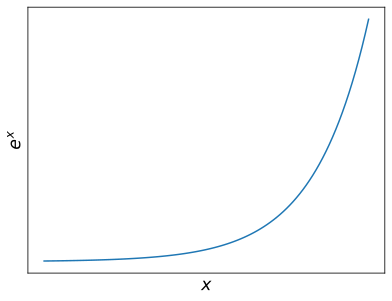
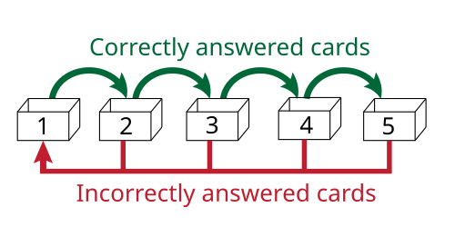
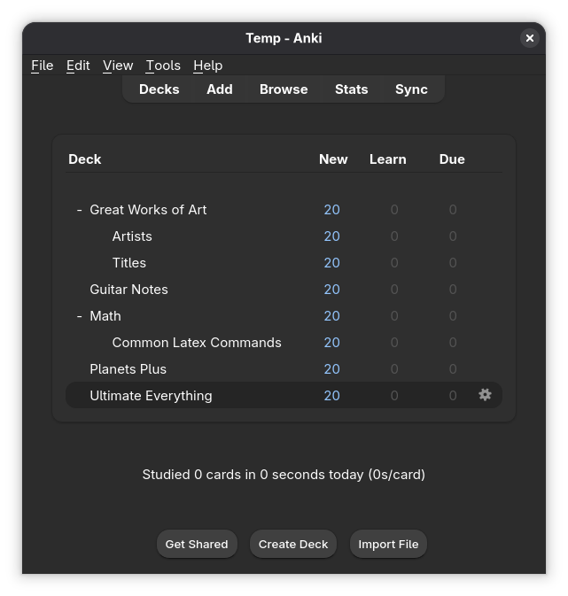
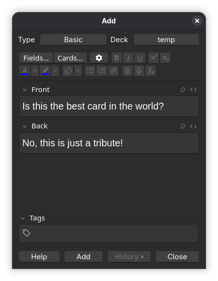
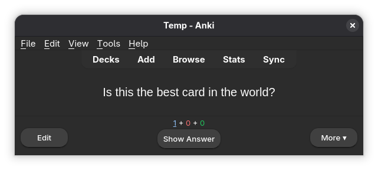
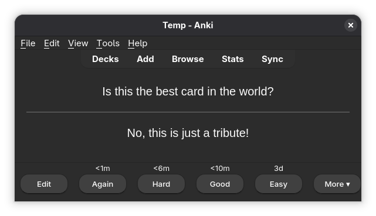
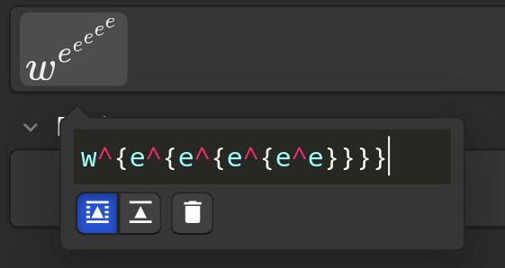

## The Problem

I want to remember things like:

::: {.incremental}
- There are 8 (or is it 9?) planets in the solar system
- $a^n + b^n = c^n$ has no positive integer solutions for integer $n > 2$
:::

::: {.fragment}
- $e^x$ looks something like this:

{style="height: 30vh;"}
:::

## What can I do?

::: {.fragment}
Cram?
:::

::: {.fragment}
- Dubious effectiveness (especially long-term)
- Super stressful!
:::

::: {.fragment}
Spaced out reading?
:::

::: {.fragment}
- Much more sustainable
- Passive
:::

## The solution?

::: {.fragment}
Flashcards!

{style="height: 50vh;"}

Achieves active recall - effective!
:::

## Further improvement

Some efficiency gains can be had:

- More reviews $\to$ better recall $\to$ fewer reviews needed later
- Why review something I remember easily?

::: {.fragment}
Solved by **spaced repetition**

Successful recall?

- If yes, wait longer until next attempt
- If not, attempt again soon

{style="height:20vh;"}
:::

## But...

- I have over 1000 flashcards - stacked together, over 25cm high!
- Managing spaced repetition for each one? Good luck!
- What even is the optimal spacing?

::: {.fragment}
If only something could help...
:::

## Anki! {style="text-align: center;"}

{style="height: 70vh;" fig-align="center"}

A flashcard **program**!

## Basic Workflow:

::: {.columns}
::: {.column width="50%"}
Create a card:

:::

::: {.column width="50%" .fragment}
Review a card:

:::

:::

## Now I can...

::: {.incremental}
- Review any card, any time, any place
    - Any device! (sync)
- Easily backup all of my cards
- Use complicated spaced repetition algorithms without thinking
    - Focus on learning the cards!
:::

## Other helpful features:

::: {.incremental}
- Made a mistake? Just edit!
- Support for images, video, audio
- Support for LaTeX
:::

::: {.fragment}
{style="height: 50vh;"}
:::

## The cherry on top:

Anki is free and open-source! ([GitHub](https://github.com/ankitects/anki/tree/main))

::: {.incremental}
- Can be extended with other plugins
- Other people have already shared their plugins and card decks!
:::

## To summarise:

Anki has been a big boost to my studies because of:

- Portability
- Automatic spaced repetition
- Digital features on cards

# Thank you!

The repository for this presentation can be found at [https://github.com/AshtonautEdu/anki_presentation](https://github.com/AshtonautEdu/anki_presentation/tree/main)
